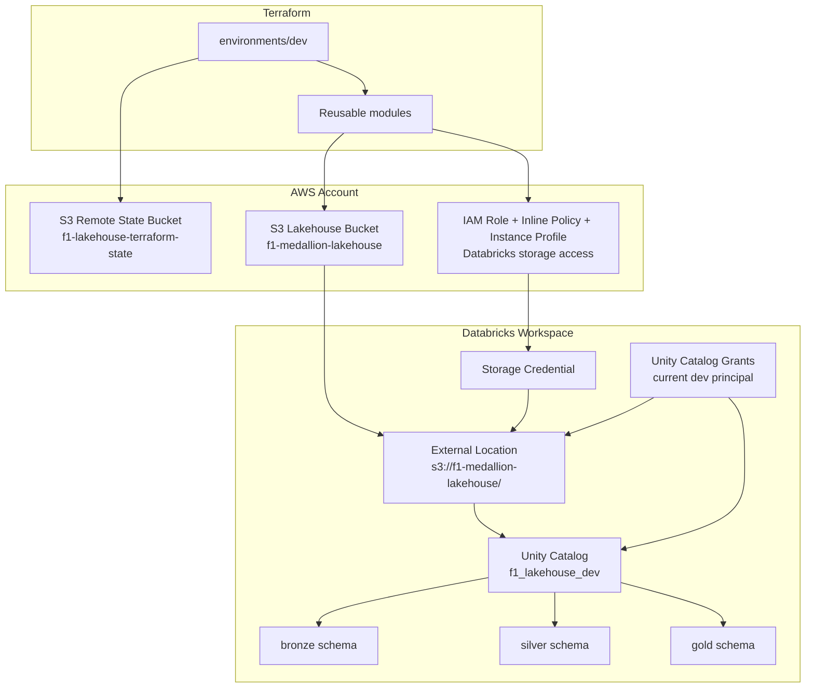

# Platform Architecture Diagram

```mermaid
flowchart TB
    subgraph AWS["AWS Account"]
        STATE["S3 Remote State Bucket\nf1-lakehouse-terraform-state"]
        S3["S3 Lakehouse Bucket\nf1-medallion-lakehouse"]
        IAM["IAM Role + Inline Policy + Instance Profile\nDatabricks storage access"]
    end

    subgraph DBX["Databricks Workspace"]
        SC["Storage Credential"]
        EL["External Location\ns3://f1-medallion-lakehouse/"]
        UC["Unity Catalog\nf1_lakehouse_dev"]
        BRONZE["bronze schema"]
        SILVER["silver schema"]
        GOLD["gold schema"]
        GRANTS["Unity Catalog Grants\ncurrent dev principal"]
    end

    subgraph TF["Terraform"]
        DEV["environments/dev"]
        MODS["Reusable modules"]
    end

    DEV --> MODS
    DEV --> STATE
    MODS --> S3
    MODS --> IAM
    IAM --> SC
    S3 --> EL
    SC --> EL
    EL --> UC
    UC --> BRONZE
    UC --> SILVER
    UC --> GOLD
    GRANTS --> UC
    GRANTS --> EL
```
